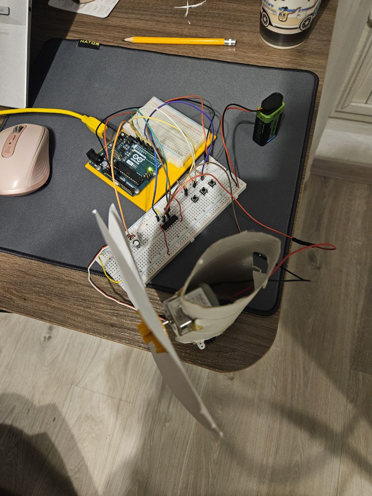

# 🪭 Fan Control System with Servo and DC Motor Project
In this project, I made a simple fan from scrap that uses Servo and DC motor.

# 📲 How to use
1. The top button turns on the fan and set a normal mode for fan speed.
2. The middle button turns on the high fan speed mode.
3. The bottom button turns off the fan.

# ⚙️ Used Components
1. Resistor 10 kOhm - 3
2. Push button - 3
3. H bridge motor driver (L293DNE) - 1
4. Capacitor 25V, 100uF - 1
5. Servo motor (SM-S2309S) - 1
6. DC motor - 1
7. Jumper wires - 21
8. Male header pins - 3 (pins together)
9. Battery 9V - 1
10. Battery to wire adapter - 1

# Images of circuit

## Real Circuit

## 📺 Project Video
  

# Description
Godly fan =)  
I have always wanted to build my own fan since I started learning about servo and DC motors, and now it came time, as you can see there are three buttons that control fan, it has two modes normal and high speed and also you can turn it off, just like a regular fan.
