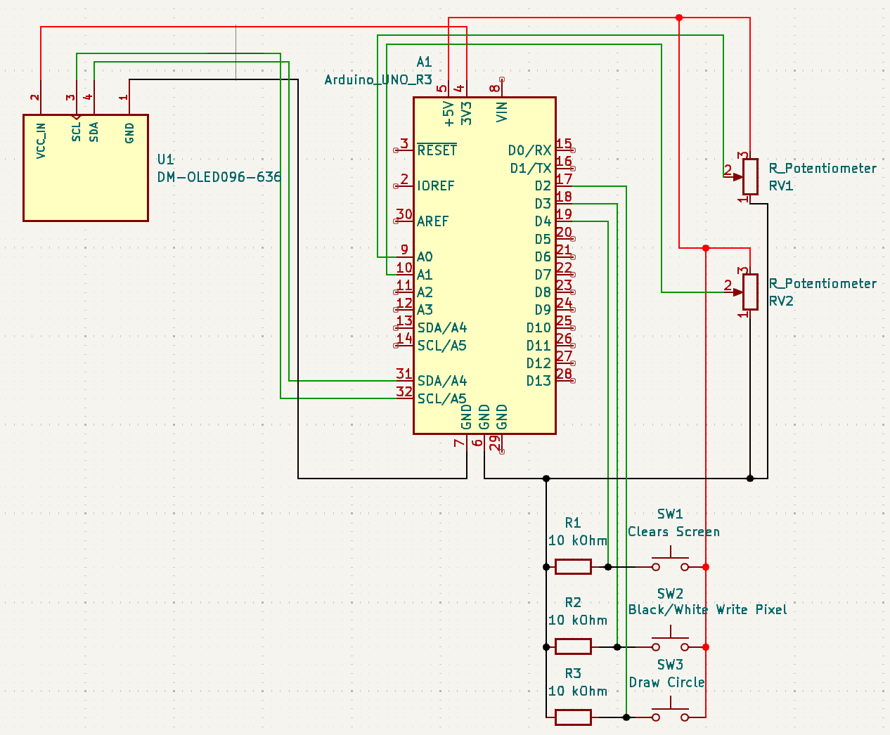
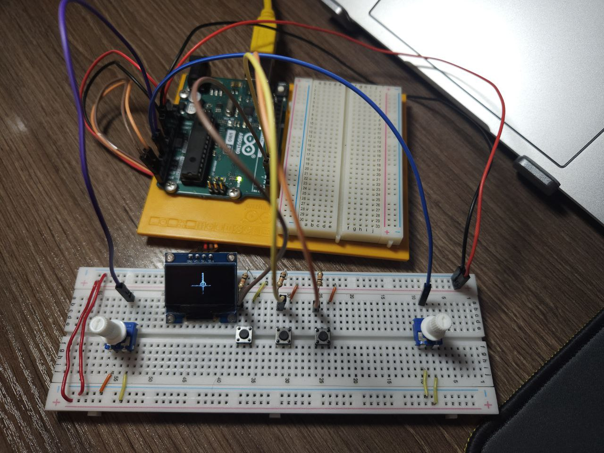

# 📟 I2C OLED Display Mini Paint Project
In this project, I made a simple mini paint program that uses OLED display and communicate via I2C (Inter-Integrated Circuit) interface with Arduino UNO R3.

# 📲 How to use
1. The left and right potentiometers control the X and Y axes.
2. The left button draws a circle at the current position of the cursor on the display.
3. The middle button writes a WHITE pixel on the screen. If pressed again, it toggles to write BLACK pixels.
4. The right button clears the display.

# ⚙️ Used Components
1. Resistor 10 kOhm - 3
2. OLED Display 0.96" I2C 128x64 WHITE - 1
3. Push button - 3
4. Potentiometer - 2
5. Jumper wires - 20

# Images of circuit

## KiCad Circuit

## Real Circuit

## 📺 Project Video  
  

# Description
As you could see before, the main goal of this project is to implement I2C communication between an Arduino and OLED display. So, what I made in this project is a small "mini paint" program that draws white pixels on the display based on the cursor's position. The cursor can be controled by two potentiometers, which adjust the X and Y axes. For diversity, I added three buttons that can draw a circle, write white and black pixels and clear the display.
