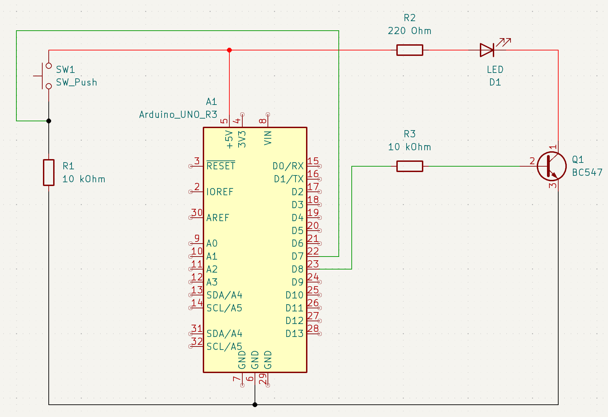
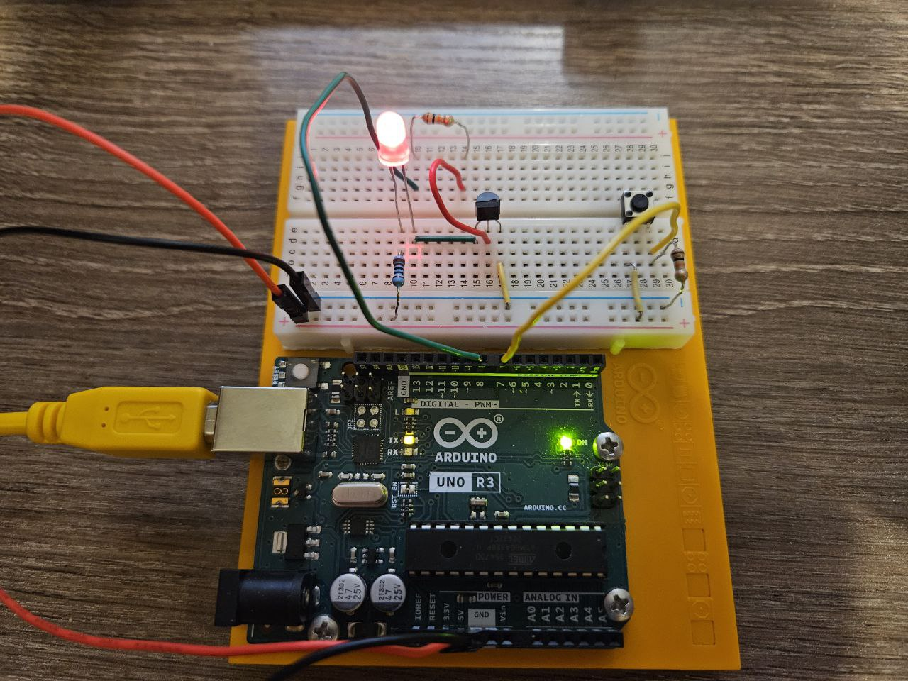

# 💡Transistor LED Control Project
In this project, I implemented LED control by using a transistor (BC547). Purpose of this small project to learn and demonstrate how transistors work and where you can use it.

# ⚙️ Used Components
1. Push button - 1 
2. Resistor 220 Ohm - 1 
3. Resistor 10 kOhm - 2
4. Red LED - 1
5. Transistor (BC547 B331) - 1
6. Jumper wires - 8

# Images of circuit

# Description
The concept of this project is to turn an LED on and off using a transistor. The code implements a switch algorithm to supply voltage to the base pin of the transistor through a 10 kΩ resistor. A push button with a pull-down resistor (10 kΩ) is used as an input device to send a signal to the Arduino, indicating whether to turn the LED on or off.

The anode of the LED is connected to the power supply through a 220 Ω resistor, while the cathode is connected to the collector of the transistor. This setup allows current to flow through the transistor when it is activated.

When the push button is pressed, a small voltage of approximately 0.7 V is sent to the base pin of the transistor. This voltage is sufficient to activate the transistor, allowing current to flow from the collector to the emitter (emitter is connect to ground), turning on or off the LED.

