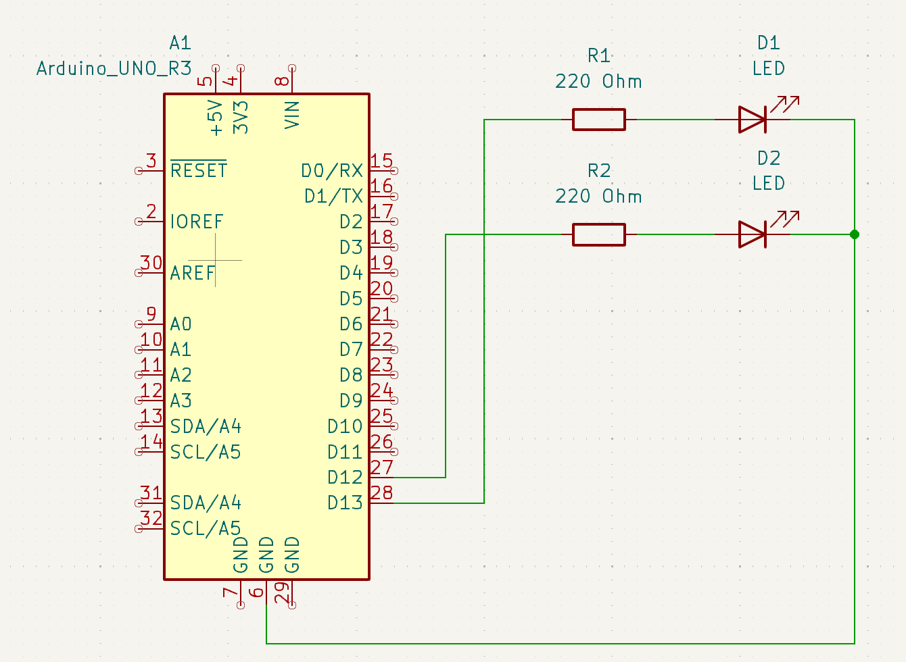
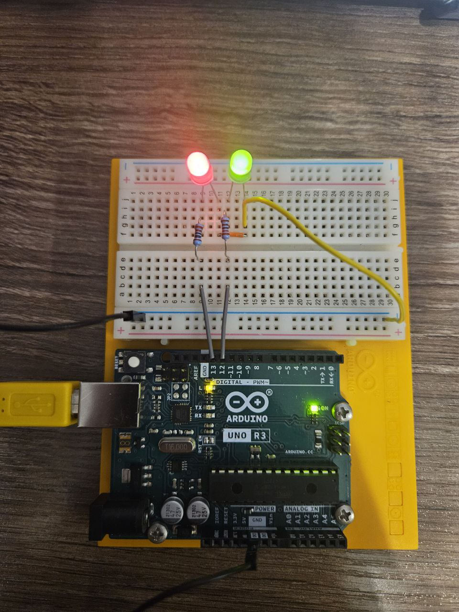
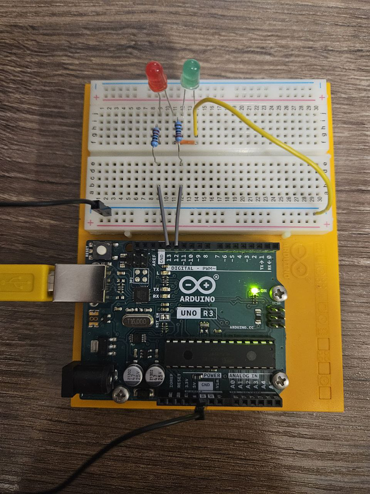
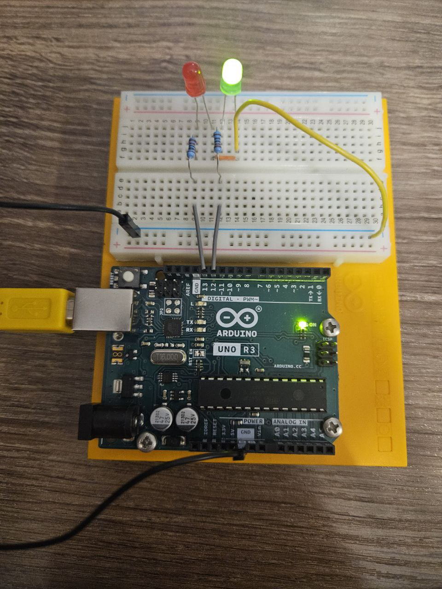
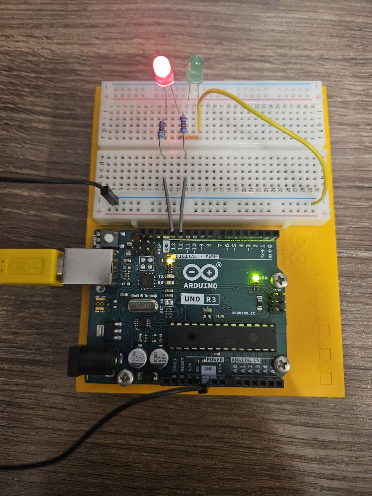

# 💡 UART LED Control Project
In this project, I implemented LED control by using Universal Asynchronous Receiver-Transmitter (UART), a serial communication protocol. You can partially control two LEDs through the Serial Monitor.

# 📲 How to use
1. Command "ON" turns on LEDs.
2. Command "OFF" turns off LEDs.
3. Command "BLINK" Makes two LEDs blink successively.
4. If you write unknown command, you will get an "Invalid command".

# ⚙️ Used Components
1. Resistor 220 Ohm - 2
2. Red, Green LED - 2
3. Jumper wires - 5

# Images of circuit

## KiCad circuit

## Turned on LEDs

## Turned off LEDs

## Blinking LEDs

# Description
This project is not based on fully use of UART but more in partial way. So, as you can see from the pictures, I connected two LEDs to pins 13-12 through the 220 Ohm resistors and in the end connected them to the common ground. 

In the code part, I declared and initialized LEDs and text variables. In the setup function I established `Serial.begin(9600)` in the setup() function that initializes the UART communication with a baud rate of **9600** and made our LEDs pinMode to **OUTPUT**.

In the loop, the program constantly checks if any data is available from the serial connection using `Serial.available()`. If data is available (you send some data from the Serial Monitor), it reads the incoming string with `Serial.readString()` then it also uses `incomingString.trim();` to get rid of some spaces or newlines in input data.

After all, in if statements it checks what the input was, if it receives ON, program will turn on LEDs and if OFF, it will turn them off etc. 

