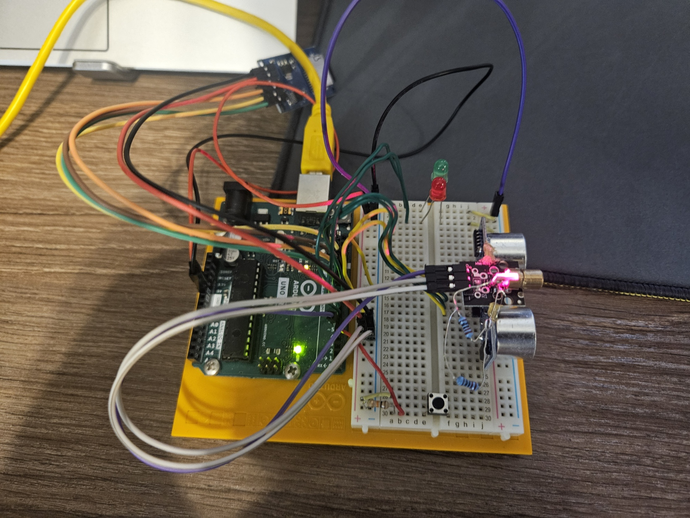
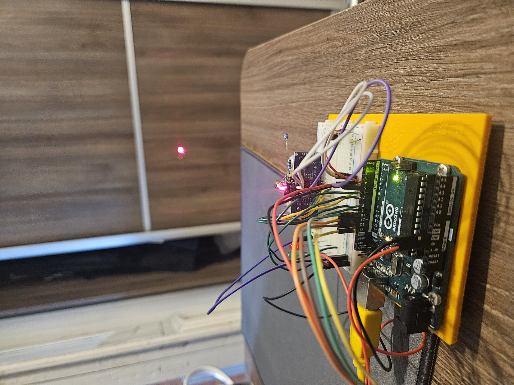
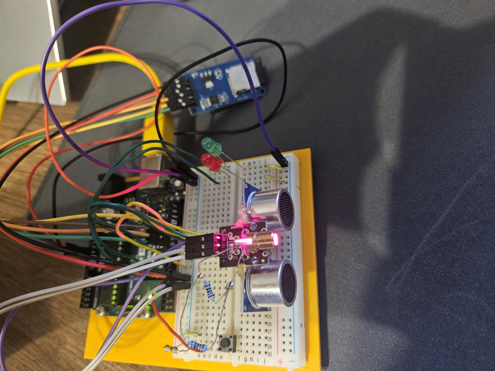

# Ultrasonic Distance Meter Version 1
Simple implementation of ultrasonic distance meter device to measures the distance to an object. 

# 📲 How to use
1. Single button to save a current distance to an object.

# ⚙️ Used Components
1. LEDs - 2
2. Ultrasonic sensor (HC-SR04) - 1
3. Laser Module Board (HW-493) - 1
4. Micro SD Card Adapter (HW-125) - 1
5. Micro SD Card - 1
6. Push button - 1
7. Resistor 10 kOhm - 1
8. Jumper wires

# Images of circuit

## Real Circuit

## 📺 Project Video
   

# Description
Now I’m gonna explain how everything works. In this project, I used an ultrasonic sensor with a laser module glued to it, so you can see exactly where the ultrasonic waves hit an object. After that, I added a micro SD module to save the distance on the SD card. If the distance is saved successfully, the green LED lights up if not, the red LED turns on.
